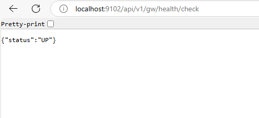
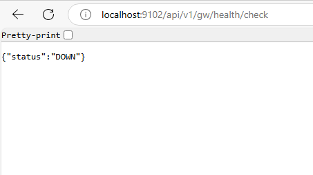
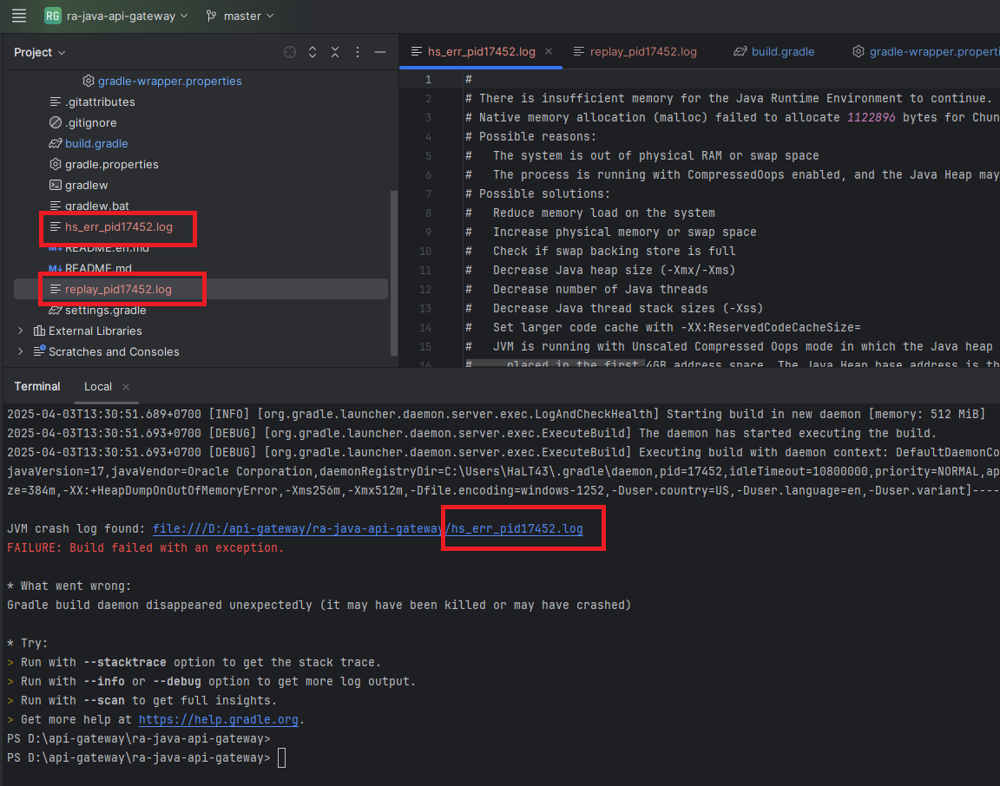

# RA-JAVA-API-GATEWAY

## Introduction

This project is used to check as if gateway is working or not.

## Prerequisites

- JDK 17 or higher
- Lombok
- Gradle 8.3 (or use the included Gradle wrapper)

## Project Structure

The project consists of the module:

- `api-gateway` - Check activity status of gateway, shutdown gateway service.

## Installation and Setup

1. Clone the repository:

```bash
git clone <repository-url>
cd api-gateway
```

2. Build the project:

```bash
./gradlew clean build
```

> [!NOTE]
> 
> In case you get error `./gradlew: Permission denied` you should try to run one of these command  
>
>    -``sudo chmod +x ./gradlew``
>    
>    -``git update-index --chmod=+x gradlew``
> 
> Then retry from step 2 above.

## Running the Application

1. Start the service:

```bash
./gradlew :api-gateway:bootRun
```

> [!NOTE]
> 
> You can also run project in IDE likes IntelliJ, Eclipse, ...
> In case you get error when starting this project, you should check the project config:
> - JDK version 
> - Gradle config
> - Proxy prevention
> - Try to remove '.gradle' folder inside project and rebuild gradle in step 2 (Build the project)

2. Gateway health:

- Check health: http://localhost:9102/api/v1/gw/health/check



- Turn down gateway: http://localhost:9102/api/v1/gw/health/down



## Related Repositories

- [ra-java-framework-common](https://github.com/skccmygit/ra-java-framework-common) API Management / Menu Management / Code Management / File Management / etc.
- [ra-java-framework-work-batch](https://github.com/skccmygit/ra-java-framework-work-batch) API Log / Account Permission related batch

## Troubleshooting

- Check  error log for detailed error messages in the console of IDE or file generated in the project directory.


